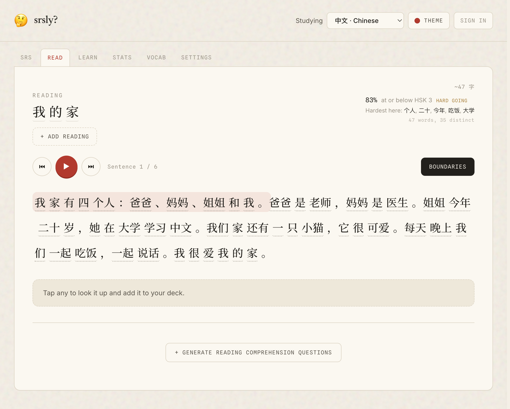
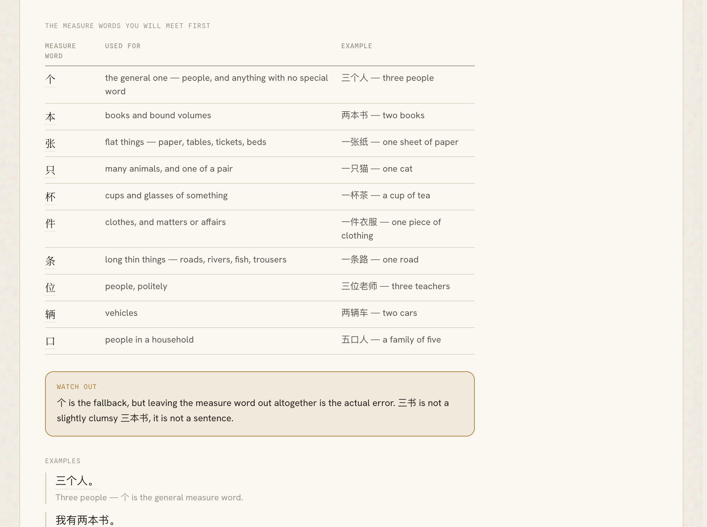
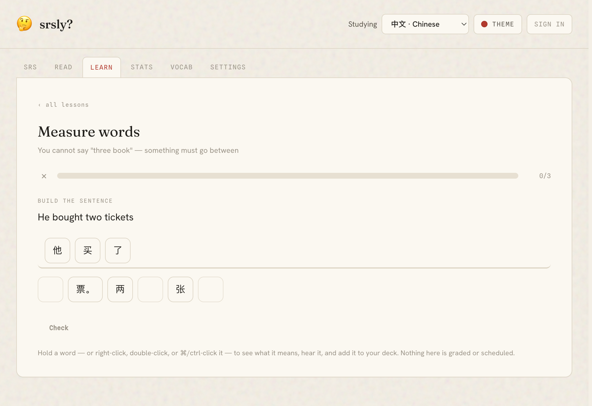
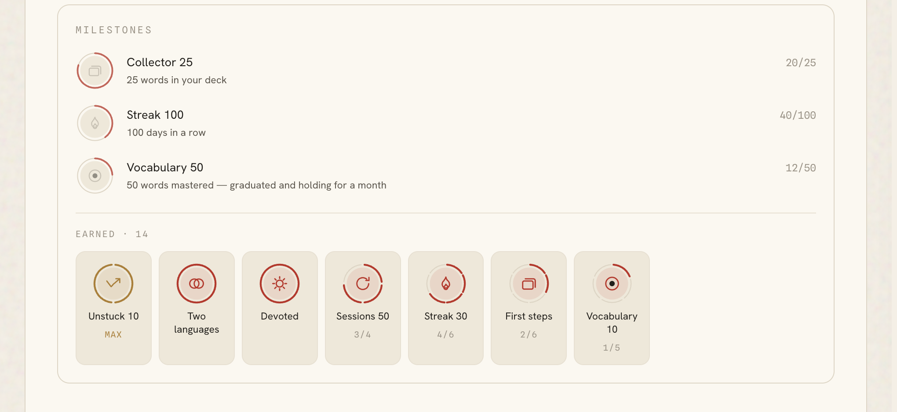

# srsly

[](https://github.com/xyzqm/srsly/actions/workflows/ci.yml)
[](LICENSE)

**A reading-first spaced-repetition app for Chinese, Japanese, Spanish and French.** You read
something you actually wanted to read — an article, a novel, a chapter of an EPUB — tap the
words you don't know, and they become scheduled review cards. The app's whole argument is that
levels are a map, not the goal.

<!-- TODO: replace with the deployed URL once the Vercel project is claimed. -->
**Live demo:** _not yet linked_ · **Engineering log:** [CLAUDE.md](CLAUDE.md)

---



<table>
<tr>
<td width="50%"></td>
<td width="50%"></td>
</tr>
<tr>
<td colspan="2"></td>
</tr>
</table>

---

## What is actually hard here

The stack is Next.js on Vercel with Supabase for sync, which is the least interesting thing
about this project. The hard parts are these.

### Four languages, four different segmentation problems

You cannot tap a word until you know where words begin, and no two of these languages make that
the same problem.

- **Chinese is scored, not greedy-longest** ([`lib/server/chineseSegmenter.ts`](lib/server/chineseSegmenter.ts)).
  A 121k-entry dictionary makes longest-match wrong in *both* directions: a long rare entry
  beats a common pair (我家的小猫 read as 家的, CC-CEDICT's "(old) wife"), and a long match
  strands what it leaves (中国人民 → 中国人 + a bare 民). A `wordScore` standing in for
  log P(word) is maximised over each Han run by dynamic programming. Because every score is
  negative, adding a word *costs* something — which is what keeps 小猫 whole instead of
  splitting it into two commoner characters.
- **Japanese needs morpheme fusion.** kuromoji splits 使っています into four pieces; a fusion
  pass re-merges its output into whole conjugated words before anything is looked up.
- **French and Spanish needed lemmatizers written from scratch**
  ([`lib/server/frenchLemmatizer.ts`](lib/server/frenchLemmatizer.ts),
  [`lib/server/spanishLemmatizer.ts`](lib/server/spanishLemmatizer.ts)) — there is no published
  npm lemmatizer for French, and a Snowball *stemmer* is the wrong tool because stemmers emit
  non-words (`manger` → `mang`) while every candidate here must validate against a real
  headword. The interesting cases are homographs: `livre` is "book" before it is a form of
  `livrer`, but `est` really is "is" before it is the noun "east". Getting that ordering wrong
  makes "n'est pas" resolve to a compass direction.

### Grading vocabulary difficulty from open data

CEFR publishes no official word list, so the bands are derived and the derivation is the work.
Words are ranked across **three registers** (everyday, news, reference) by the **mean of their
two best per-register ranks** — averaging *ranks* rather than frequencies stops whichever corpus
has the most extreme distribution from setting the order, and needing two placements *is* the
"common in more than one register" rule.

The bands are then cross-checked against an English anchor (CEFR-J + Octanove, 8,845 headwords).
The anchor has a large systematic bias, so it **swaps pairs across a band boundary** instead of
reassigning words to their anchor level — a uniform pull cancels by construction, only relative
disagreement moves anything, and every band keeps its curriculum size. It moves ~3–4% of words.

Both of those choices were measured against alternatives that failed. So was a blend that
**inverted**: adding a non-narrative register to French ranked `guerre` and `mort` *higher* and
pushed `bonjour` to B2, because conflict is core news vocabulary and greetings are not.

### A hand-written FSRS scheduler

[`lib/fsrs.ts`](lib/fsrs.ts) implements FSRS v4.5 directly — 19 weights, learning steps, the
retrievability curve `R(t,S) = (1 + F·t/S)^D`. Not a dependency. Mastery is measured as
*stability*, not review count, because "passed eight times" describes a card you keep
forgetting just as well as one you know.

### Performance work, with numbers

- **TypeScript memory: 2.13 GB → 0.31 GB** (2.86M → 220k symbols). With `resolveJsonModule` on,
  tsc opens every generated JSON file and materialises an object type with one property per key.
  Routing those imports through an alias tsc *cannot resolve* lets an ambient declaration apply
  instead, so the files are never read — while webpack resolves them normally and chunk
  splitting is unaffected.
- **First-load JS: ~890 kB → 295 kB.** The level tables are 338 kB–900 kB of source each.
  Loading them on demand rather than importing them at module scope is the whole difference.
- **A shipped grammar table cut from 22.6 MB to 4.2 MB** by keeping only the forms the
  lemmatizer can actually produce — 93% of Wiktionary's Spanish conjugations can never match a
  `baseForm`, so they were 15 MB that could never render.

## How it is verified

**563 tests across 26 files**, and they cover [`lib/`](lib) rather than components — deliberately.
The bugs that actually happened were in pure functions with documented but unasserted contracts:
`œuvres` lemmatising to a verb, NFD normalisation shredding every accented word, `d'accord`
resolving to "chord" under a typographic apostrophe. Those are cheap to pin and expensive to
notice.

The lemmatizer tests load the **real** dictionaries rather than fixtures, because their
assertions are claims about that data — "`est` is a headword meaning east, which is why peeling
`n'est` needs a second pass" — and a stub would test the regex instead of the behaviour.

UI work is verified by **driving the actual app**, not by unit-testing components. That rule is
in [CLAUDE.md](CLAUDE.md) because it keeps earning itself: the practice exercise once presented
its tiles already in the correct order, solvable by tapping left to right without reading a
word, and every existing assertion passed because they all checked *which* tiles existed and
none checked their order.

```bash
npm test        # 563 tests
npm run lint    # 0 warnings
npm run typecheck
```

## Architecture

Next.js 15 App Router, React 19, TypeScript, Tailwind v4. One client page with tab panels
rather than routes — tabs stay mounted so a reading session survives a trip to the deck.

Storage is an interface: [`lib/storage/types.ts`](lib/storage/types.ts) defines `DataService`,
and a singleton starts on `LocalStorage` and swaps in `SupabaseStorage` after sign-in, which
composes the local one as an offline read cache and write-through. **The app is fully usable
signed out** — sign-in buys sync, nothing else.

Postgres has row-level security on every table, and the guest AI budget is enforced by a
`SECURITY DEFINER` function with `revoke all from public`, so the limit lives in the database
rather than in the client that is asking for credit
([`supabase/schema.sql`](supabase/schema.sql)).

**Generation is bring-your-own-key.** srsly is free to run and free to use; the one thing that
costs money is having a new passage written, so that uses the learner's own Anthropic key, sent
on a header rather than in a body or URL because URLs get logged by proxies and a logged
credential is a leaked one. Reading your own text, an EPUB or a starter text makes **no model
call at all**.

## The build pipeline

The dictionaries and level tables are generated, never hand-edited — 21 MB of JSON built from
open corpora by scripts in [`scripts/`](scripts):

| Script | Emits |
|---|---|
| `build-cedict.mjs` | `public/cedict.json` |
| `build-jmdict.mjs` | `public/jmdict.json`, the JLPT tables |
| `build-esdict.mjs` / `build-frdict.mjs` | the Spanish and French dictionaries, form tables and CEFR bands |
| `build-frgrammar.mjs` / `build-esgrammar.mjs` | which grammatical slot each inflected form fills |
| `build-lesson-practice.ts` | the Learn tab's practice tiles, cut by the real segmenters |

Proper nouns are filtered at build time by a shared `nameFilter`, per *sense* rather than per
entry — so `jean` keeps "denim" and loses the given name.

## Some decisions, and why

The full engineering log is [CLAUDE.md](CLAUDE.md). A few worth reading:

- **[An idea that was built, measured, and removed.](CLAUDE.md#environment)** A local Ollama
  generator worked — 5/5 usable passages from `qwen2.5:3b` — but it runs on localhost, so it
  could only ever serve the machine it was installed on, and it was reached for to make
  generation free for *learners*. It was deleted. It left one permanent fix: the 3B model
  returned the literal placeholder string `WORDS` as a title 2 times in 5 where Haiku never
  did, so the prompt now says the title is one you write. **A weaker model is a good prompt
  linter.**
- **[Levels are calibration, not the goal.](CLAUDE.md#the-lesson-tree)** Lessons are sequenced
  but nothing is ever locked, and pasted text and EPUBs ignore levels entirely. A learner who
  believes the ladder is the point will not open their own book.
- **[Only generated passages have blanks.](CLAUDE.md#a-passage-is-generated-only-when-asked-for)**
  A generated passage is written around the words you owe today, so it may fairly test you. A
  novel you chose carries no such contract, and turning it into an exercise is how reading
  stops being the reward.
- **[Two numbers, two questions.](CLAUDE.md#how-hard-is-this-for-me)** "How many of these words
  have I studied?" and "is this written near my level?" routinely disagree, and both readings
  are correct. Showing one number and calling it "coverage" is what made that confusing.
- **[Readability was scoring Japanese exactly backwards.](CLAUDE.md#how-hard-is-this-for-me)**
  HSK and CEFR number their bands easiest-first; JLPT numbers them the other way. Comparing raw
  level numbers put を and する among a starter text's hardest words. Comparing *rank* took it
  from 0% to 91%.

## Running it

```bash
npm install
npm run dev      # localhost:3000
```

No API key is needed to read, look words up, use an EPUB, or review flashcards. Passage
generation asks for your own Anthropic key in Settings (about 1¢ a passage, billed to you by
Anthropic, never stored anywhere but the device you typed it on). Sync needs a Supabase
project — see [`supabase/schema.sql`](supabase/schema.sql), which is a one-file setup.

## Licence and data

srsly's source is **MIT** ([LICENSE](LICENSE)).

The dictionaries it redistributes are not. They are derived from CC-CEDICT, JMdict and
Wiktionary and stay under **CC BY-SA 4.0**; the character-decomposition data is **LGPL-3.0**.
[NOTICE.md](NOTICE.md) covers what ships, and
[`scripts/data/ATTRIBUTION.md`](scripts/data/ATTRIBUTION.md) covers the build-time inputs —
including why the LGPL source was chosen over the more obvious GPLv2 one for the only dataset
whose licence travels into the browser.

## On how this was built

srsly is built with heavy AI assistance, and it seems worth saying so plainly rather than
leaving it to be inferred from the commit trailers.

I use AI for generation and acceleration; the architecture, the product decisions and the
verification are mine. What I think that actually looks like is in this repository:
[CLAUDE.md](CLAUDE.md) is a decision log — measurements, and the alternatives that were tried
and rejected, and the bugs that were only ever found by running the app rather than reading it.
Deciding that the Ollama generator had to go despite working, that a cap on blank density was
silently overriding an explicit setting, or that a "fix" which made 90% of a licence check pass
was hiding a deleted dictionary entry — that is the part I would want to be judged on, and it
is the part a model does not do for you.
